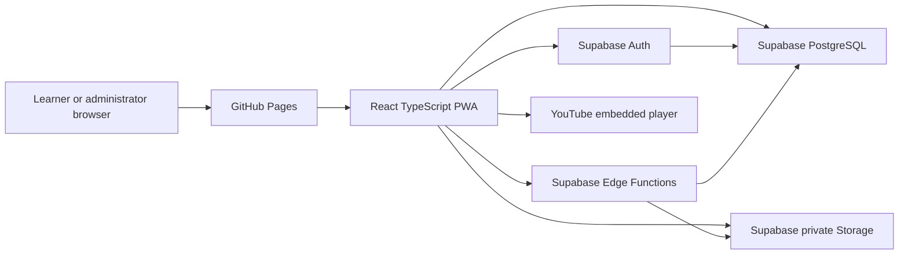
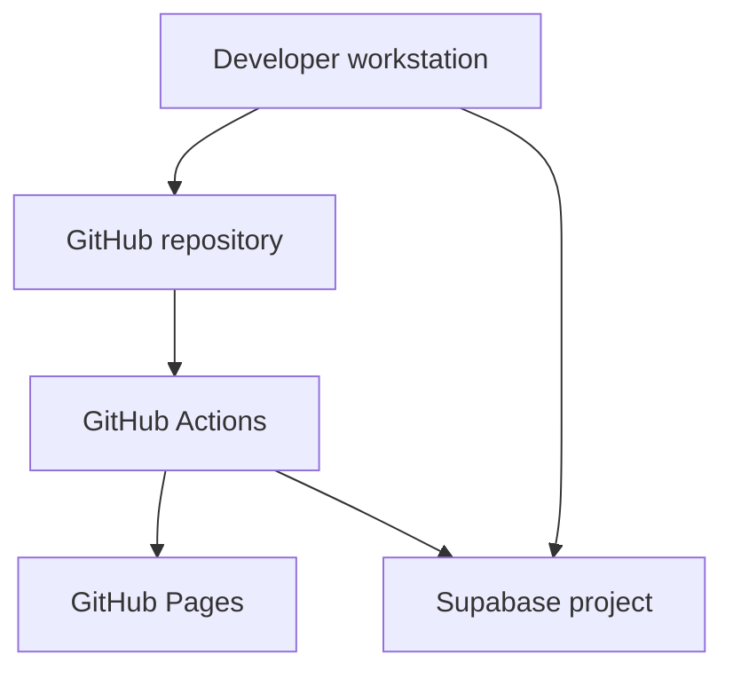

# Architecture

## Summary

The system is a client-side React single-page application hosted on GitHub Pages and connected directly to Supabase using a publishable browser key.

Security is enforced through Supabase Auth, PostgreSQL Row Level Security, database constraints, controlled database functions, private Storage buckets, and Supabase Edge Functions.

## System diagram

## Frontend responsibilities

- Render responsive learner and admin interfaces
- Maintain the authenticated session
- Request authorized data
- Validate forms for usability
- Show loading, empty, offline, error, expired, and denied states
- Display videos and protected PDFs
- Autosave quiz answers
- Present server-calculated results
- Deliver bilingual interface in English and Bahasa Melayu (`en` / `ms`)
- Provide intermediary invitation acceptance to defend against email security prefetchers
- Register the PWA service worker
- Never contain privileged secrets

## Backend responsibilities

### Supabase Auth

- User identity
- Email verification
- Password reset
- Session issuance and refresh
- Optional future social login

### PostgreSQL

- Profiles (`public.profiles` with language preference and `pending_registration` state)
- Protected learner identities (`private.learner_identities` in isolated private schema boundary; no direct browser SELECT)
- Roles and staff hierarchy
- Durable staff authorization intent (`public.staff_access_entries`)
- Organizations
- Cohorts (with reversible `learner_access_state`)
- Cohort courses (`public.cohort_courses` multi-course associations with optional schedule/venue overrides)
- Cohort learner roster staging (`public.cohort_learner_roster`)
- Application-managed access invitations (`public.access_invitations` referencing exactly one intent target with 7-day lifecycle)
- Courses and entitlements
- Resources and immutable versions
- Quizzes, questions, and attempt snapshots
- Audit logs

### Row Level Security & Schema Isolation

- Restrict learners to their own records
- Restrict course data to active entitlement and `learner_access_state = 'open'`
- Restrict instructors to assigned cohorts
- Strictly deny browser roles direct SELECT on `private.learner_identities` (instructors receive server-derived masked projection `******-**-1234` via secure RPC only)
- Restrict administrators to their organization scope
- Prevent learners from reading correct-answer fields
- Prevent learners from altering scores, roles, or entitlements

### Database functions

Use for transactional, data-centric operations such as:

- Complete learner registration and atomic identity establishment
- Start quiz attempt
- Autosave answer
- Submit quiz
- Reorder resources
- Grant access
- Complete course
- Record controlled progress

### Edge Functions

Use when the operation requires:

- Supabase Auth administration
- Secret credentials
- Application-controlled email dispatch (governed by Phase 7.3 Email Transport Spike)
- One-time passwordless return link issuance for existing users (Phase 7.5 Spike)
- Signed resource delivery
- Certificate generation
- Large report generation
- External service integration
- Additional rate limiting

## Trust boundaries

### Untrusted

- Browser
- Frontend state
- Route guards
- Form validation
- Client timestamps
- Client-calculated progress
- Client-calculated quiz results

### Trusted when correctly configured

- PostgreSQL constraints
- RLS policies
- Security-definer functions with restricted execution
- Edge Functions using server-side secrets
- Authenticated Supabase session claims
- Private Storage access policies

## Data-access patterns

### Direct RLS-protected reads

Suitable for:

- Own profile
- Assigned courses
- Published resource metadata
- Own progress
- Own results

### Controlled RPC functions

Suitable for:

- Transactional writes
- Reordering
- Starting attempts
- Autosaving answers
- Final quiz submission
- Access changes
- Completion decisions

### Edge Functions

Suitable for:

- User invitations
- Auth user suspension or deletion
- Resource access issuance
- Certificate generation
- Large exports
- External integration

## Deployment architecture

Recommended production discipline:

- Pull requests run checks.
- `main` is protected.
- Frontend deployment occurs after successful build and tests.
- Database migrations are reviewed and applied separately.
- Production secrets are stored only in trusted deployment systems.

## Routing

GitHub Pages does not provide general SPA rewrites.

Preferred options:

1. Browser routing with a `404.html` fallback and route restoration.
2. Hash routing for the simplest reliable setup.

The codebase should keep routing decisions isolated so migration to Cloudflare Pages remains simple.

## Scalability considerations

- Use server-side pagination for admin tables.
- Aggregate event data for analytics.
- Avoid loading full attempt or event history into the browser.
- Use indexes for entitlement checks, published resources, user attempts, and audit filtering.
- Partition or archive high-volume event tables if they grow significantly.
- Avoid excessive high-frequency video progress events.

## Availability

The initial application depends on:

- GitHub Pages availability
- Supabase Auth, Database, Storage, and Functions availability
- YouTube availability for video lessons
- Network availability for protected learning content

The PWA shell may load offline, but protected resources and new quiz attempts require an online authorization check.
