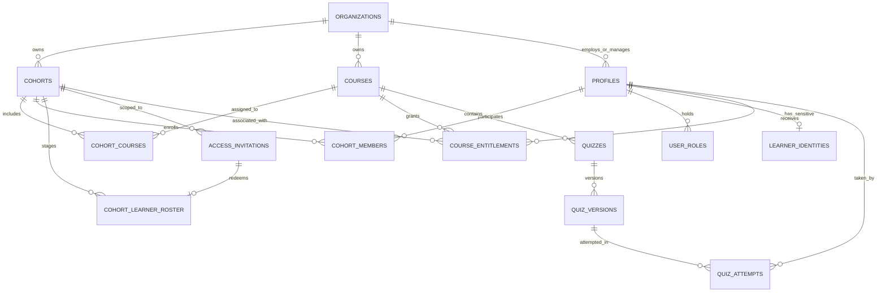
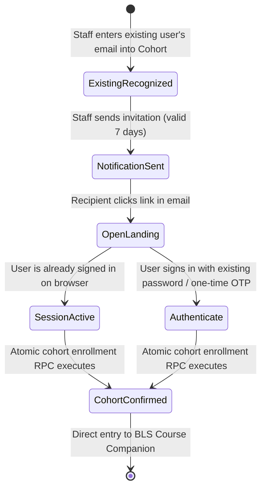
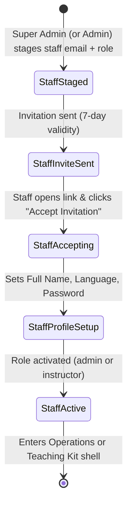

# Milestone 7 Architecture Plan: Controlled Onboarding, Multi-Course Cohorts & Bilingual Foundation

## 1. Executive Summary & Scope

Milestone 7 transitions the BLS Course Companion from an operational MVP prototype into a production-grade, bilingual platform ready for physical Basic Life Support course delivery. It solves the critical pre-launch operational requirements:
1. **Controlled Learner Onboarding**: Staff pre-enter learner **emails only**; learners register their own legal name, national identity card (I.C.) number, preferred language, and password after verifying email control.
2. **Staff Access Hierarchy**: Super-administrators onboard administrators and instructors; administrators onboard instructors and manage cohorts; instructors onboard and manage learners strictly within assigned cohorts.
3. **Application-Controlled 7-Day Invitations**: A secure 7-day invitation lifecycle that prevents premature email-scanner consumption, supports idempotency and resend with superseding, and decouples invitation validity from sensitive short-lived auth tokens.
4. **Existing User Continuity**: Reusable learner accounts that receive new cohort invitations without repeating identity registration or forced password changes.
5. **Multi-Course Cohorts**: Supporting multiple courses per cohort (every cohort learner receives every cohort course) via an expand-backfill-contract migration from `cohorts.course_id` to `cohort_courses`.
6. **Reversible Cohort Learner-Access Gate**: A clean `learner_access_state` (`open` | `closed`) enabling administrators to open or close cohort learner access without deleting accounts, attempts, or entitlements.
7. **National Identity (I.C.) Privacy**: A dedicated protected data boundary ensuring administrators can view full I.C.s when operationally required, instructors see only masked values (`******-**-1234`), and learners view/edit only their own data.
8. **Bilingual Foundation (English & Bahasa Melayu)**: An internationalized frontend with `en` (default/fallback) and `ms` locales, bilingual onboarding emails, separate human-authored content, and historically frozen bilingual quiz questions.

This phase is **architecture and documentation only**. No application source code, migrations, or hosted database mutations are performed during this planning run.

---

## 2. Locked Product Requirements Reconciliation

The following locked product decisions govern all Milestone 7 designs:

| Requirement Area | Locked Product Decision | Architectural Realization |
|---|---|---|
| **Q1: Role Management** | `super_admin` invites `admin` and `instructor`; `admin` invites `instructor` and manages cohorts; `instructor` invites learners *only* within assigned cohorts. No UI creation of `super_admin`. | Security definer functions enforce caller role and organization scope; Edge Functions reject privilege escalation; client guards prevent unauthorized UI exposure. |
| **Q2: Pre-Invitation Data** | Staff enter **email only** for learners. First-time registration collects: full name, I.C., language preference (`en` \| `ms`), password, password confirmation. Invited email is immutable. | Roster entries store email intent before `auth.users` exists; `pending_registration` profile state gates access until registration RPC transaction commits. |
| **Q3: Invitation Validity** | Invitations valid for **7 days**. Expired invites can be resent; resend supersedes old invite. No account penalty for expiry. | `access_invitations` table manages application-level 7-day validity and superseding. An intermediary landing page protects one-time redemption from email security bots. |
| **Q4: Existing Users** | Existing users receive new cohort email; link recognizes account; no re-registration or forced password change; cohort membership linked. Optional password recovery available. | Fast-path redemption links existing `auth.users` profile to cohort; bypasses registration screen; directs immediately to authenticated companion. |
| **Q5: Multi-Course Cohorts** | Cohorts can contain multiple courses. Every cohort learner receives every cohort course. No per-learner picker in M7. | `cohort_courses` join table introduced. Migration follows expand → backfill → dual-read → contract. Entitlements synchronized to all attached courses. |
| **Q6: Cohort Instructors** | Cohorts may have multiple assigned instructors. Assigned instructors manage learners in their cohorts only. Cannot self-assign or manage other cohorts. | `cohort_members` with `member_role = 'instructor'` scoped in RLS. Roster mutations require assigned instructor or org admin caller. |
| **Q7: Cohort Access Lifetime** | Access starts upon account activation. No auto-expiry by date. Admin/super_admin explicitly toggles "Close cohort access" / "Restore cohort access". Fully reversible. | `cohorts.learner_access_state` enum (`open`, `closed`). Effective course access check enforces `open` state. Attempt and audit history preserved. |
| **Q8: Learner Removal** | Removing learner from cohort revokes cohort access; global account, profile, I.C., past quiz attempts, and results remain intact. Re-add reuses account. | Soft removal updates `cohort_members.membership_status = 'removed'`. Does not suspend profile or delete attempts. |
| **Q9: Roster & Import** | Manual email addition + bulk paste/CSV import. Pre-validation preview: valid new, existing user, already in cohort, invalid email, duplicate, conflict. Adding vs sending are separate actions. | Roster staging workflow: import/validate → save to roster (`not_invited`) → explicit "Send Invitations" dispatch action. |
| **Q10: Bilingual Product** | Primary languages: English (`en`, default/fallback) and Bahasa Melayu (`ms`). Pre-registration emails bilingual. UI uses translation keys. Content authored separately (no runtime machine translation). Quiz versions freeze bilingual text. | `preferred_language` on profile; frontend translation dictionary provider; versioned bilingual question prompts and option text; resource language taxonomy. |
| **Q11: Invitation Lifecycle** | User-facing statuses: *Not invited*, *Invited*, *Activated*, *Expired*, *Failed*, *Suspended*, *Removed*. | Normalized schema across roster entries, `access_invitations`, and `profiles.account_status` computes authoritative user-facing status. |
| **Q12: Pre-Launch Clean Slate** | Production demo/test data retained during M7 development; one controlled clean-slate reset executed immediately prior to real participant onboarding. | Clean-slate boundaries documented in `docs/DEPLOYMENT.md`; seed fixtures remain CI/local-only. |
| **I.C. Data Privacy** | Full I.C. visible to `super_admin`/`admin` and learner (own). Instructors see masked I.C. (`******-**-1234`) only. No logging/audit leaks. | Dedicated `learner_identities` table with strict RLS (instructors denied SELECT). Masked projection provided via secure view/RPC. |

---

## 3. Current vs. Target Gap Analysis & Migration Paths

### Gap 1: Single Course Cohorts vs. Multi-Course Cohorts
- **Current**: `public.cohorts.course_id` (UUID, NOT NULL). RLS helpers (`private.is_assigned_instructor_for_course`, `private.has_effective_course_access`, `private.validate_cohort_course`), quiz availability functions, and frontend components assume 1:1 cohort-to-course relationship.
- **Target**: A cohort has $N$ courses via `public.cohort_courses`.
- **Migration Strategy (Expand-Backfill-Contract)**:
  1. *Expand*: Create `public.cohort_courses` table with composite primary key `(cohort_id, course_id)`, `display_order`, and timestamps.
  2. *Backfill*: Copy existing `(id, course_id, 0)` from `public.cohorts` into `public.cohort_courses`.
  3. *Dual-Write/Read Trigger*: Install a synchronization trigger that populates `cohort_courses` if legacy `cohorts.course_id` is written, and keeps `cohorts.course_id` set to the primary (first) course.
  4. *Helper & RLS Refactoring*: Update `has_effective_course_access()` and instructor check functions to query `cohort_courses`.
  5. *Application Cutover*: Update frontend queries and mutations to read/write `cohort_courses`.
  6. *Contract*: Alter `cohorts.course_id` to nullable; deprecate in documentation; drop column in future cleanup migration after production parity is verified.

### Gap 2: One Active Cohort Per Learner Constraint
- **Current**: Unique partial index `one_active_cohort_per_learner` on `public.cohort_members(user_id) WHERE member_role = 'learner' AND membership_status = 'active'`.
- **Target**: Learners can participate in new/subsequent cohorts over time. Historical and concurrent active memberships must be allowed.
- **Migration Strategy**:
  1. Drop `one_active_cohort_per_learner` partial unique index.
  2. Retain existing composite primary key `(cohort_id, user_id)` on `public.cohort_members` to prevent duplicate membership within the *same* cohort.
  3. Update learner home UI to display current/upcoming active cohort(s) with an active cohort switcher if enrolled in multiple concurrent cohorts.

### Gap 3: Upfront Full Name Requirement vs. Email-Only Roster
- **Current**: `public.provision_invited_user` requires `full_name text` (1-160 characters). `InviteUserDialog` and Edge Function `admin-invite-user` reject submissions missing a name.
- **Target**: Staff enter email only. Learner supplies full name, I.C., language, and password during first-time registration.
- **Migration Strategy**:
  1. Create `public.cohort_learner_roster` and `public.access_invitations` tables to record email intent before `auth.users` exists.
  2. Decouple roster addition from Auth user creation. Auth user and profile are provisioned either in a restricted `pending_registration` state or upon invitation redemption.
  3. Registration page `/auth/register` accepts full name and persists it atomically upon password establishment.

### Gap 4: Duplicate User Rejection vs. Existing User Reuse
- **Current**: Edge Function `admin-invite-user` detects `isDuplicateUserError` and returns HTTP 409 `USER_ALREADY_EXISTS`. Existing users cannot be added to a new cohort via invitation.
- **Target**: Existing users can be invited to new cohorts. Their identity is recognized; they receive a notification email with cohort and course details; clicking accepts the cohort without re-entering personal data.
- **Migration Strategy**:
  1. Update invitation logic to check if the normalized email already exists in `auth.users` / `public.profiles`.
  2. For existing users: create `cohort_learner_roster` and `cohort_members` entry, record an `access_invitation` of type `existing_user_cohort_addition`, and send an existing-user cohort assignment email.
  3. Redemption recognizes existing session/user, links entitlements, and routes directly to the application shell.

### Gap 5: Premature Account Activation on Email Confirmation
- **Current**: Trigger `handle_auth_user_confirmed` on `auth.users` immediately transitions `profiles.account_status` from `pending_verification` to `'active'` whenever `email_confirmed_at` becomes NOT NULL.
- **Target**: First-time learners must complete profile registration (full name, I.C., language, password) before becoming active.
- **Migration Strategy**:
  1. Add `pending_registration` to `public.account_status` enum.
  2. Update `handle_auth_user_confirmed`: set `account_status = 'pending_registration'` (not `active`) for uncompleted learner profiles.
  3. Update `RequireAccountAccess` guard to treat `pending_registration` as an uncompleted setup state, redirecting to `/auth/register`.
  4. Atomic registration completion RPC `complete_learner_registration` transitions `pending_registration` → `active` only after personal data is validated.

### Gap 6: Generic Staff Provisioning vs. Strict Role Hierarchy
- **Current**: `admin-invite-user` allows `admin` to invite `learner` or `instructor`. No pathway for `super_admin` to onboard an `admin`, nor for instructors to invite learners to their own cohorts.
- **Target**: Strict role hierarchy (Q1).
- **Migration Strategy**:
  1. Implement staff access invitation workflow: `super_admin` can invite `admin` or `instructor`; `admin` can invite `instructor`.
  2. Implement cohort roster invitation workflow: assigned `instructor` or `admin` can add/invite learners within cohort scope.
  3. Enforce role hierarchy in both database security definer functions and Edge Functions.

---

## 4. Target Domain Model



### Table Specifications & Responsibilities

#### 1. `public.cohort_courses` (New)
Represents the many-to-many relationship between cohorts and courses.
- `cohort_id uuid not null references public.cohorts(id) on delete cascade`
- `course_id uuid not null references public.courses(id) on delete restrict`
- `display_order integer not null default 0 check (display_order >= 0)`
- `created_at timestamptz not null default now()`
- `created_by uuid references public.profiles(id) on delete set null`
- **Primary Key**: `(cohort_id, course_id)`
- **Indexes**: `cohort_courses_course_idx on (course_id)`

#### 2. `public.cohorts` (Modified)
- `learner_access_state public.cohort_access_state not null default 'open'` (New column)
  - Type: `create type public.cohort_access_state as enum ('open', 'closed');`
- `name_ms text` (Optional localized cohort name)
- `description_ms text` (Optional localized description)
- Legacy `course_id uuid` made nullable after backfill to `cohort_courses`.

#### 3. `public.cohort_learner_roster` (New)
Tracks intended learner participation prior to or during invitation.
- `id uuid primary key default gen_random_uuid()`
- `organization_id uuid not null references public.organizations(id) on delete restrict`
- `cohort_id uuid not null references public.cohorts(id) on delete cascade`
- `email text not null check (email = lower(trim(email)) and email ~ '^.+@.+$')`
- `roster_status text not null default 'staged' check (roster_status in ('staged', 'invited', 'activated', 'removed'))`
- `user_id uuid references public.profiles(id) on delete set null` (Populated once user account exists)
- `added_by uuid not null references public.profiles(id) on delete set null`
- `created_at timestamptz not null default now()`
- `updated_at timestamptz not null default now()`
- **Unique Constraint**: `unique (cohort_id, email)`
- **Indexes**: `roster_org_email_idx on (organization_id, email)`

#### 4. `public.access_invitations` (New)
Application-managed invitation lifecycle engine.
- `id uuid primary key default gen_random_uuid()`
- `organization_id uuid not null references public.organizations(id) on delete restrict`
- `invitation_type text not null check (invitation_type in ('new_learner_cohort', 'existing_learner_cohort', 'staff_bootstrap'))`
- `cohort_id uuid references public.cohorts(id) on delete cascade` (Required for learner invites; null for staff)
- `email text not null check (email = lower(trim(email)))`
- `intended_role public.app_role not null check (intended_role in ('learner', 'instructor', 'admin'))`
- `status text not null default 'prepared' check (status in ('prepared', 'sent', 'redeemed', 'expired', 'failed', 'superseded'))`
- `token_hash text not null unique` (Cryptographic hash of the one-time application invite secret)
- `sent_at timestamptz`
- `expires_at timestamptz not null` (Default: `now() + interval '7 days'`)
- `last_resent_at timestamptz`
- `resend_count integer not null default 0 check (resend_count >= 0)`
- `redeemed_at timestamptz`
- `redeemed_by_user_id uuid references public.profiles(id) on delete set null`
- `invited_by uuid not null references public.profiles(id) on delete set null`
- `metadata jsonb not null default '{}'::jsonb`
- `created_at timestamptz not null default now()`
- `updated_at timestamptz not null default now()`
- **Indexes**: `invitations_cohort_email_idx on (cohort_id, email)`, `invitations_token_hash_idx on (token_hash)`, `invitations_expires_idx on (expires_at) where status = 'sent'`

#### 5. `public.learner_identities` (New — Sensitive Data Boundary)
Isolated table holding Malaysian Identity Card (MyKad) and government identity records.
- `user_id uuid primary key references public.profiles(id) on delete cascade`
- `id_type text not null default 'mykad' check (id_type in ('mykad', 'passport'))`
- `id_number text not null check (char_length(trim(id_number)) between 6 and 20)` (Normalized alphanumeric)
- `masked_id text not null check (char_length(trim(masked_id)) between 6 and 25)` (e.g. `******-**-1234`)
- `verified_at timestamptz`
- `created_at timestamptz not null default now()`
- `updated_at timestamptz not null default now()`
- **Security Policy**: Strictly deny SELECT to `authenticated` public and `instructor` role. Only accessible to `super_admin`, `admin` of the same organization, and the learner themselves (`user_id = auth.uid()`). Masked values are exposed to instructors via a restricted secure projection view `public.roster_identities_masked`.

#### 6. `public.profiles` (Modified)
- `preferred_language text not null default 'en' check (preferred_language in ('en', 'ms'))`
- `account_status`: Update enum to include `'pending_registration'`:
  `('pending_verification', 'pending_registration', 'pending_approval', 'active', 'suspended', 'expired', 'archived')`

#### 7. `public.cohort_members` (Modified)
- Drop partial index `one_active_cohort_per_learner`.
- Maintain composite primary key `(cohort_id, user_id)`.

---

## 5. State Machines

### 5.1 First-Time Learner Registration State Machine

```mermaid
stateDiagram-v2
    [*] --> RosterStaged: Staff enters email into Cohort Roster
    RosterStaged --> InvitationSent: Staff clicks "Send Invitations" (valid for 7 days)
    
    InvitationSent --> Expired: 7 days elapse without redemption
    Expired --> InvitationSent: Staff clicks "Resend Invitation" (creates fresh 7-day token, supersedes old)
    
    InvitationSent --> VerifyingLink: Recipient opens email link & clicks "Accept Invitation"
    VerifyingLink --> PendingRegistration: Auth identity created/resolved; email confirmed
    
    PendingRegistration --> Active: Recipient completes registration form (Full Name, I.C., Language, Password)
    Active --> [*]: Enrolled in cohort, course entitlements active, admitted to app
```



#### Detailed State Transition Rules:
1. **Roster Entry (`roster_status = 'staged'`)**:
   - Authorized actor (assigned instructor or admin) adds email to cohort.
   - `auth.users` row does NOT exist yet.
   - Invitation record created in `prepared` status.
2. **Invitation Dispatch (`roster_status = 'invited'`, `access_invitations.status = 'sent'`)**:
   - `sent_at = now()`, `expires_at = now() + interval '7 days'`.
   - Bilingual (EN + BM) invitation email sent via Custom SMTP.
   - Link format: `https://dr-afif.github.io/bls/#/invite/accept?token={secret}`.
3. **Link Visit & Bot Defense**:
   - Intermediary landing page renders cohort information, courses list, and venue.
   - Email prefetching scanners only make GET requests to the static page; they do NOT trigger state changes or consume the one-time token.
   - User clicks button: "Accept Invitation & Setup Account".
4. **Auth Exchange & Account Restriction (`account_status = 'pending_registration'`)**:
   - Server validates 7-day token.
   - GoTrue user is created / verified with `email_confirmed_at = now()`.
   - `profiles.account_status = 'pending_registration'`.
   - Browser receives authenticated session restricted to the `/auth/register` route. Route guards reject access to `/app/*`.
5. **Registration Form Submission**:
   - Learner enters: Full Name, I.C. Number, Preferred Language (`en` or `ms`), Password, Password Confirmation.
   - Recipient cannot alter the invited email address.
   - Form posts to atomic RPC `complete_learner_registration`.
6. **Atomic Activation (`account_status = 'active'`)**:
   - RPC updates `profiles.full_name`, `profiles.preferred_language`, sets `account_status = 'active'`.
   - Inserts normalized and masked I.C. into `public.learner_identities`.
   - Assigns `learner` role in `public.user_roles`.
   - Creates active membership in `public.cohort_members`.
   - Provisions active course entitlements in `public.course_entitlements` for all courses in `cohort_courses`.
   - Updates `access_invitations.status = 'redeemed'` and `cohort_learner_roster.roster_status = 'activated'`.
   - Audits `learner.registered` and `cohort.membership_activated`.
   - Redirects to `/app` (Learner Home) in chosen language.

---

### 5.2 Existing User Cohort Addition State Machine



#### Detailed State Transition Rules:
1. **Existing User Detection**:
   - During roster import or manual entry, system detects that `auth.users` / `public.profiles` already contains the email.
   - Existing profile details (full name, I.C., preferred language) are retained.
2. **Notification Email**:
   - Email is personalized in the user's stored `preferred_language`.
   - Subject: *"You have been added to a new BLS Course cohort: {Cohort Name}"*.
   - Clearly lists all courses attached to the cohort and physical session details.
   - Does NOT instruct the user to register or provide personal details.
   - Contains link: `https://dr-afif.github.io/bls/#/invite/accept?token={secret}`.
3. **Redemption & Enrollment**:
   - Recipient clicks link.
   - If user has active browser session: clicks "Confirm Enrollment" -> server calls `enroll_existing_user_in_cohort`.
   - If user is not logged in: prompted for password (with "Forgot Password" recovery path). Upon authentication, enrollment completes.
   - RPC atomically creates `cohort_members` row and `course_entitlements` for all cohort courses.
   - User transitions directly to companion home. No identity re-entry.

---

### 5.3 Staff Bootstrap State Machine



#### Detailed Hierarchy Rules:
- `super_admin`: Can invite `admin` or `instructor`.
- `admin`: Can invite `instructor` only. Attempting to invite `admin` or `super_admin` returns 403 `FORBIDDEN_ROLE_ESCALATION`.
- `instructor`: Cannot invite staff.
- `super_admin` role cannot be granted through the standard application UI.

---

## 6. Multi-Course Architecture & Migration

### Schema Model
```sql
create table public.cohort_courses (
  cohort_id uuid not null references public.cohorts (id) on delete cascade,
  course_id uuid not null references public.courses (id) on delete restrict,
  display_order integer not null default 0 check (display_order >= 0),
  created_at timestamptz not null default now(),
  created_by uuid references public.profiles (id) on delete set null,
  primary key (cohort_id, course_id)
);

create index cohort_courses_course_idx on public.cohort_courses (course_id);
```

### Affected System Dependencies & Remediation Plan:
1. **`private.is_assigned_instructor_for_course(target_course_id uuid)`**:
   - *Current*: `join public.cohorts c on c.id = cm.cohort_id where c.course_id = target_course_id`
   - *Target*: `join public.cohort_courses cc on cc.cohort_id = cm.cohort_id where cc.course_id = target_course_id`
2. **`private.has_effective_course_access(target_course_id uuid)`**:
   - Update to ensure cohort access check validates membership in a cohort linked via `cohort_courses` to `target_course_id` and verifies `cohorts.learner_access_state = 'open'`.
3. **`private.validate_cohort_course()` Trigger**:
   - Replaced by a trigger on `cohort_courses` verifying that the linked course belongs to the same organization as the cohort.
4. **Quiz Engine Assignment (`start_quiz_attempt`)**:
   - *Current*: `join public.cohorts c on c.id = cm.cohort_id and c.course_id = q.course_id`
   - *Target*: `join public.cohort_courses cc on cc.cohort_id = cm.cohort_id and cc.course_id = q.course_id`
5. **Frontend Repositories**:
   - `src/features/operations/data/people-cohorts-repository.ts`: Update `getCohorts()`, `getCohortById()`, and `createCohort()` to support `course_ids: string[]`.
   - `src/features/learner/`: Update learner home and course navigation to list all courses in the learner's active cohort.

---

## 7. Cohort Access Lifetime & Reversible Close/Restore

### Access State Design
Rather than destructively modifying or deleting `course_entitlements` or `cohort_members`, cohort access lifetime is governed by an explicit gate column on `public.cohorts`:
- `learner_access_state public.cohort_access_state not null default 'open'`

### Operational Semantics:
- **`open`**: Enrolled learners with active memberships can view course guides, watch videos, download PDFs, take pre/post-tests, and view results.
- **`closed`**: Enrolled learners retain their accounts, past attempts, scores, and personal records, but cannot access course resources or start new quiz attempts. The learner UI displays:
  > *"Cohort access is currently closed by the course administrator. Your historical quiz scores and profile remain saved."*
- **Reversible Action**:
  - `admin` or `super_admin` can toggle between `open` and `closed` at any time via RPC `set_cohort_learner_access_state(cohort_id, new_state)`.
  - Closing or restoring access is strictly audited (`cohort.access_closed`, `cohort.access_restored`).
  - Instructors can view `learner_access_state` in Teaching Kit but cannot mutate it.

---

## 8. National Identity (I.C.) Privacy & Masking

### Sensitivity Context
In Malaysia, the Identity Card (MyKad) number is a 12-digit national identifier (`YYMMDD-PB-###G`) containing birth date, birth place, and gender. It is sensitive personal data under Malaysian personal data protection standards.

### Privacy Boundary Architecture
1. **Physical Isolation**:
   - Stored in dedicated table `public.learner_identities` (not in `public.profiles`).
   - Columns: `user_id`, `id_type`, `id_number` (full normalized), `masked_id` (e.g. `******-**-1234`), timestamps.
2. **Access Control (RLS)**:
   - `learner`: Can SELECT only their own record (`user_id = auth.uid()`).
   - `super_admin` & `admin`: Can SELECT full records for learners in their organization.
   - `instructor`: **STRICTLY DENIED** SELECT on `learner_identities`. RLS policy grants zero access to instructors on this table.
3. **Instructor Masked View**:
   - A secure view / RPC `public.get_cohort_roster_for_instructor(cohort_id)` returns only `masked_id`. The instructor client never receives the full I.C. in network payloads.
4. **Audit and Log Sanitation**:
   - Audit triggers and Edge Functions must never record `id_number` in `audit_events.metadata`.
   - Masked format or entity ID only in audit records.
   - Client error messages must never reflect submitted I.C. numbers.

---

## 9. Bilingual Application Architecture (English & Bahasa Melayu)

### Locales
- **`en`**: English (Default & technical fallback).
- **`ms`**: Bahasa Melayu (Secondary language).

### Architecture Principles:
1. **No Duplicated Component Trees**:
   - Single React component tree utilizing a lightweight, typed translation hook `useTranslation()`.
   - Translation dictionaries located in `src/lib/i18n/dictionaries/` (`en.ts`, `ms.ts`).
2. **Persistence**:
   - Stored in `profiles.preferred_language` for authenticated users.
   - Stored in browser `localStorage` (`bls_language_preference`) for unauthenticated visitors.
3. **Pre-Registration Invitations**:
   - Invitation emails sent to new learners contain side-by-side or stacked bilingual copy (English followed by Bahasa Melayu).
4. **Authored Clinical & Educational Content**:
   - **No Runtime Machine Translation**: Medical and CPR guidelines require precise human terminology approved by clinical committees.
   - Resources: Categorized by language (`en`, `ms`, `bilingual`, `language_independent`).
   - Quizzes: Questions and options support bilingual text fields:
     - `question_versions.prompt` (English default)
     - `question_versions.prompt_ms` (Bahasa Melayu)
     - `question_options.option_text` (English default)
     - `question_options.option_text_ms` (Bahasa Melayu)
   - Both variants are **historically frozen** within the versioned question record. Attempt snapshots store both English and Malay prompts/options so that historical reviews remain completely immutable.

---

## 10. Email Design Contracts

All emails are dispatched through the verified Custom SMTP infrastructure (`smtp.gmail.com:465`, sender `BLS Course Companion`).

### Email Categories & Contracts:

#### 1. New Learner Cohort Invitation
- **Recipient**: Unregistered learner email.
- **Language**: Bilingual (English & Bahasa Melayu).
- **Subject**: `Invitation to Basic Life Support Course / Jemputan ke Kursus BLS`
- **Dynamic Content**:
  - Recipient email
  - Cohort name
  - List of attached courses (rendered dynamically from `cohort_courses`)
  - Course date(s), start time, and venue
  - Contact person / organizer name
  - Notice: Valid for 7 days; personal and non-transferable
- **Action CTA**: `Accept Invitation / Terima Jemputan` -> `https://dr-afif.github.io/bls/#/invite/accept?token={token}`

#### 2. Existing Learner Cohort Addition
- **Recipient**: Registered learner email.
- **Language**: Recipient's stored `preferred_language` (fallback to English).
- **Subject**: `New Course Cohort Assignment: {Cohort Name}`
- **Dynamic Content**:
  - Cohort name and attached courses
  - Date, time, venue
  - Direct login notice (clarifies that registration is NOT repeated)
  - Optional password reset reminder link
- **Action CTA**: `Open BLS Course Companion` -> `https://dr-afif.github.io/bls/#/invite/accept?token={token}`

#### 3. Staff Bootstrap Invitation
- **Recipient**: Invited Administrator or Instructor.
- **Language**: English (with Malay option).
- **Subject**: `Staff Invitation: BLS Course Companion ({Role})`
- **Dynamic Content**:
  - Assigned role (`Instructor` or `Administrator`)
  - Organization name
  - Security warning (privileged staff access)
  - 7-day validity notice
- **Action CTA**: `Setup Staff Account` -> `https://dr-afif.github.io/bls/#/invite/accept?token={token}`

#### 4. Invitation Resend
- **Recipient**: Pending invitee with expired or unredeemed invite.
- **Subject**: `Reminder / Resend: Your BLS Course Companion Invitation`
- **Content**: States clearly that a fresh 7-day invitation has been issued, replacing any previous links.

---

## 11. Audit Events & Security Invariants

### New Audit Actions
The system records structured audit events to `public.audit_events` for all lifecycle changes:
- `roster.entry_added`: Email staged in cohort roster.
- `roster.entry_removed`: Staged email removed from roster.
- `invitation.sent`: 7-day invitation token generated and dispatched.
- `invitation.resent`: Expired invitation replaced by fresh token.
- `invitation.redeemed`: Invitation successfully consumed by user.
- `learner.registered`: First-time registration completed (name, I.C., language set).
- `cohort.membership_activated`: Learner added to `cohort_members`.
- `cohort.learner_removed`: Learner removed from cohort.
- `cohort.instructor_assigned`: Instructor linked to cohort.
- `cohort.instructor_removed`: Instructor unlinked from cohort.
- `cohort.access_closed`: Cohort learner access gated to `closed`.
- `cohort.access_restored`: Cohort learner access restored to `open`.
- `staff.invited`: Staff onboarding invite sent (super_admin -> admin/instructor; admin -> instructor).
- `identity.updated`: Learner updated own legal profile details.

### Strict Security Invariants:
1. **No Sensitive Data in Audit**: Never write raw tokens, passwords, token hashes, or full I.C. numbers into `audit_events.metadata`.
2. **Fixed Search Path**: All new database functions enforce `SET search_path = ''`.
3. **Fail-Closed Gate**: If an invitation token is expired, tampered with, or already redeemed, the API rejects with HTTP 400/403 and zero session state is issued.
4. **Idempotent Redemption**: Competing requests on the same invitation token are serialized via `SELECT ... FOR UPDATE`; subsequent callers fail cleanly.
5. **No Cross-Tenant Provisioning**: Administrators and instructors cannot invite or manage users outside their assigned `organization_id`.

---

## 12. Phased Implementation Plan (Milestones 7.1 – 7.7)

```mermaid
gantt
    title Milestone 7 Phased Implementation Sequence
    dateFormat  X
    axisFormat %s
    section Core Infrastructure
    Phase 7.1 Schema & Compatibility Foundation       :active, 0, 1
    Phase 7.2 Bilingual Application Foundation        :1, 2
    section Identity & Onboarding
    Phase 7.3 Staff Bootstrap & Invitations           :2, 3
    Phase 7.4 Cohort Roster & Invitation Engine       :3, 4
    Phase 7.5 First-Time & Returning Registration     :4, 5
    section Cohort Access & Polish
    Phase 7.6 Multi-Course Access & Close/Restore     :5, 6
    Phase 7.7 E2E Production Verification             :6, 7
```



### Phase 7.1 — Schema & Compatibility Foundation
- **Objectives**: Deploy core relational models and compatibility views without breaking existing functionality.
- **Deliverables**:
  - Migration creating `cohort_courses`, `cohort_learner_roster`, `access_invitations`, `learner_identities`.
  - Add `learner_access_state` enum and column to `cohorts`.
  - Add `pending_registration` to `account_status` enum.
  - Drop `one_active_cohort_per_learner` partial unique index.
  - Backfill `cohort_courses` from `cohorts.course_id`.
  - Update `private.handle_auth_user_confirmed()` to transition first-time users to `pending_registration`.
  - Regenerate TypeScript database types (`src/lib/supabase/database.types.ts`).
  - Automated pgTAP tests verifying schema constraints, RLS policies, and backfill parity.

### Phase 7.2 — Bilingual Application Foundation
- **Objectives**: Implement the client-side localization framework and bilingual data structures.
- **Deliverables**:
  - `src/lib/i18n/`: Context, provider, typed translation hook `useTranslation()`, and locale dictionaries (`en.ts`, `ms.ts`).
  - Language switcher component in header / profile settings.
  - Profile language persistence (`profiles.preferred_language`).
  - Migration adding bilingual columns (`name_ms`, `prompt_ms`, `option_text_ms`).
  - Unit tests verifying fallback to English for missing keys.

### Phase 7.3 — Staff Bootstrap & Invitations
- **Objectives**: Build the controlled staff onboarding engine adhering to the strict role hierarchy.
- **Deliverables**:
  - Edge Function / RPC `admin-invite-staff` enforcing:
    - `super_admin` can invite `admin` and `instructor`.
    - `admin` can invite `instructor`.
    - Role escalation protection (no creating `super_admin`).
  - Staff invitation acceptance and registration journey.
  - Operations UI: Staff access list with pending invite status and resend action.
  - Onboarding test suite verifying authorization boundaries.

### Phase 7.4 — Cohort Roster & Invitation Engine
- **Objectives**: Build manual email entry, bulk import/paste validation, and 7-day invitation dispatch.
- **Deliverables**:
  - Cohort Roster UI: Email input and CSV/text paste parser.
  - Pre-validation preview: valid new, existing user, duplicate, invalid, conflict.
  - Separation of Roster Staging and "Send Invitations" actions.
  - 7-day invitation generator with token hashing and superseding on resend.
  - Contextual multi-course bilingual invitation email template.
  - Instructor-scoped cohort roster permissions (assigned instructors only).

### Phase 7.5 — First-Time & Returning User Registration
- **Objectives**: Implement the secure redemption flows for new and existing participants.
- **Deliverables**:
  - Intermediary invitation landing page (`#/invite/accept?token=...`) with bot prefetch protection.
  - New learner registration page (`#/auth/register`): full name, I.C., preferred language, password.
  - Atomic RPC `complete_learner_registration`: writes profile, stores protected I.C. in `learner_identities`, activates role and memberships.
  - Returning user fast path: recognizes account, confirms cohort enrollment, skips personal registration.
  - Account-level password reset/recovery flow.
  - RLS verification: instructors cannot read full I.C.

### Phase 7.6 — Multi-Course Access + Close/Restore
- **Objectives**: Cut over the application to multi-course cohorts and enforce cohort learner access gating.
- **Deliverables**:
  - Update all course access RLS helpers to query `cohort_courses`.
  - Update learner shell and guides to navigate across all courses in assigned cohort.
  - Administrator cohort detail: attach/detach multiple courses.
  - Reversible "Close cohort access" / "Restore cohort access" admin actions.
  - Learner closed-state UI view.
  - Individual learner removal and re-add workflows.

### Phase 7.7 — E2E Production Verification
- **Objectives**: Comprehensive automated and browser verification of all Milestone 7 flows.
- **Deliverables**:
  - Vitest suite for all new components, hooks, and utilities.
  - pgTAP regression suite covering multi-course RLS, I.C. masking, role escalation, and invitation expiry.
  - Playwright E2E tests for:
    - Super-admin inviting admin.
    - Admin creating multi-course cohort and assigning instructor.
    - Instructor bulk-importing learner emails and sending invitations.
    - New learner 7-day invite redemption, registration with I.C., and course access.
    - Existing learner cohort addition.
    - Admin closing and restoring cohort access.
    - Instructor viewing masked I.C. only.

---

## 13. Pre-Launch Clean-Slate Release Gate

### Timing & Execution Invariant
- The production clean-slate reset must **NOT** be executed during Milestone 7 planning or development.
- The existing hosted test/demo data (`KTGS BANDAR SERI PUTRA`, `BLS-DEMO-01`, controlled learner probe `m***@upm.edu.my`) remains available for testing during Phases 7.1–7.7.
- **Immediately prior to onboarding the first real physical course participants**, after Phase 7.7 passes, a controlled production clean-slate reset will be performed.

### Reset Scope (Preserved vs. Purged):
- **Purged**:
  - All test cohorts (`KTGS BANDAR SERI PUTRA`, `BLS-DEMO-01`)
  - All demonstration resources, PDFs, and resource versions
  - All fictional quizzes, questions, and question versions
  - All test memberships, entitlements, and roster entries
  - All test attempts and scores
  - Controlled learner probe (`m***@upm.edu.my`) and temporary test accounts
- **Preserved**:
  - Legitimate custodian accounts (`afif89@gmail.com`, `afif89+bls@gmail.com`)
  - Organization record
  - Complete database schema and all migrations
  - Row Level Security policies and functions
  - Supabase Edge Functions (`admin-invite-user`, `issue-resource-access`)
  - Auth configuration and redirect allowlist (`https://dr-afif.github.io/bls/**`)
  - Custom SMTP configuration (`smtp.gmail.com:465`)
  - CI/CD workflows and deployment gates
  - Private storage bucket configurations (`course-resources`)
  - Required immutable system audit history

---

## 14. Explicit Deferred & Non-Goals

The following items are explicitly **excluded** from Milestone 7 to maintain strict delivery focus:
- Open public self-registration.
- Learner registration activation codes.
- Per-learner selective course picker within a cohort (all cohort learners receive all cohort courses in M7).
- Automatic cohort expiry based on course date.
- Native mobile application wrapper (Android / iOS).
- Multi-organization tenant switching.
- Digital certificate generation and verification.
- Practical skills physical sign-off.
- Machine translation at runtime.
- SMS / WhatsApp invitation channels.
- Social authentication (Google/Apple login).
- Replacing Supabase Auth or PostgreSQL.
