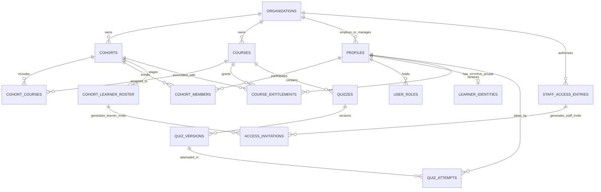
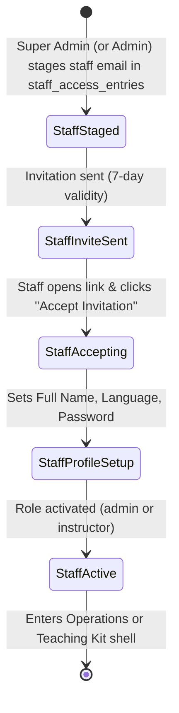

# Milestone 7 Architecture Plan: Controlled Onboarding, Multi-Course Cohorts & Bilingual Foundation

## 1. Executive Summary & Scope

Milestone 7 transitions the BLS Course Companion from an operational MVP prototype into a production-grade, bilingual platform ready for physical Basic Life Support course delivery. It solves the critical pre-launch operational requirements:
1. **Durable Authorization Intent (Before Auth Exists)**: Separates durable organizational intent (`public.cohort_learner_roster` for learners, `public.staff_access_entries` for staff) from transient invitation attempts (`public.access_invitations`).
2. **Controlled Learner Onboarding**: Staff pre-enter learner **emails only**; learners register their own legal name, national identity card (I.C.) number, preferred language, and password after verifying email control.
3. **Staff Access Hierarchy**: Super-administrators onboard administrators and instructors; administrators onboard instructors and manage cohorts; instructors onboard and manage learners strictly within assigned cohorts.
4. **Application-Controlled 7-Day Invitations**: A secure 7-day invitation lifecycle that prevents premature email-scanner consumption, supports idempotency and resend with superseding, enforces server-derived effective expiry, and references authorization intent with referential integrity.
5. **Existing User Continuity & Passwordless Return**: Reusable learner accounts. Sending an invitation to an existing active user immediately activates cohort membership and entitlements; clicking the invite link provides a seamless one-time passwordless login flow into the app without re-registration or forced password resets.
6. **Multi-Course Cohorts with Schedule Overrides**: Supporting multiple courses per cohort (every cohort learner receives every cohort course) via an expand-backfill-contract migration from `cohorts.course_id` to `cohort_courses`, with optional per-course schedule and venue overrides.
7. **Reversible Cohort Learner-Access Gate**: A clean `learner_access_state` (`open` | `closed`) enabling administrators to open or close cohort learner access without deleting accounts, attempts, or entitlements.
8. **Private National Identity (I.C.) Boundary**: Storing full I.C. records in `private.learner_identities` (denying direct table SELECT to browser roles), validating normalized MyKad/passport formats, preventing duplicate identities safely without enumeration leaks, and projecting masked identifiers (`******-**-1234`) to instructors via secure RPCs.
9. **Bilingual Foundation (English & Bahasa Melayu)**: An internationalized frontend with `en` (default/fallback) and `ms` locales, bilingual onboarding emails, separate human-authored content, and historically frozen bilingual quiz questions.
10. **Technical Implementation Spikes**: Explicit spikes for server-side Email Transport and Supabase Auth `generateLink` / `verifyOtp` one-time passwordless session establishment before coding begins.

This phase is **architecture and documentation only**. No application source code, migrations, or hosted database mutations are performed during this planning run.

---

## 2. Locked Product Requirements Reconciliation

The following locked product decisions govern all Milestone 7 designs:

| Requirement Area | Locked Product Decision | Architectural Realization |
|---|---|---|
| **Q1: Role Management** | `super_admin` invites `admin` and `instructor`; `admin` invites `instructor` and manages cohorts; `instructor` invites learners *only* within assigned cohorts. No UI creation of `super_admin`. | Security definer functions enforce caller role and organization scope; Edge Functions reject privilege escalation; client guards prevent unauthorized UI exposure. |
| **Q2: Pre-Invitation Data** | Staff enter **email only** for learners. First-time registration collects: full name, I.C., language preference (`en` \| `ms`), password, password confirmation. Invited email is immutable. | Roster entries store email intent before `auth.users` exists; `pending_registration` profile state gates access until registration RPC transaction commits. |
| **Q3: Invitation Validity** | Invitations valid for **7 days**. Expired invites can be resent; resend supersedes old invite. No account penalty for expiry. | `access_invitations` table manages application-level 7-day validity and superseding. An intermediary landing page protects one-time redemption from email security bots. Server enforces effective expiry (`status = 'sent' AND expires_at <= now()`). |
| **Q4: Existing Users** | Existing users receive new cohort email; link recognizes account; no re-registration or forced password change; cohort membership linked. Optional password recovery available. | Sending invite immediately activates membership/entitlements. Intermediary page provides a passwordless one-time return link into the app. Direct login also works immediately. |
| **Q5: Multi-Course Cohorts** | Cohorts can contain multiple courses. Every cohort learner receives every cohort course. No per-learner picker in M7. | `cohort_courses` join table introduced with optional per-course schedule overrides (`start_at`, `end_at`, `venue`). Migration follows expand → backfill → dual-read → contract. |
| **Q6: Cohort Instructors** | Cohorts may have multiple assigned instructors. Assigned instructors manage learners in their cohorts only. Cannot self-assign or manage other cohorts. | `cohort_members` with `member_role = 'instructor'` scoped in RLS. Roster mutations require assigned instructor or org admin caller. |
| **Q7: Cohort Access Lifetime** | Access starts upon account activation. No auto-expiry by date. Admin/super_admin explicitly toggles "Close cohort access" / "Restore cohort access". Fully reversible. | `cohorts.learner_access_state` enum (`open`, `closed`). Effective course access check enforces `open` state. Attempt and audit history preserved. |
| **Q8: Learner Removal** | Removing learner from cohort revokes cohort access; global account, profile, I.C., past quiz attempts, and results remain intact. Re-add reuses account. | Soft removal updates `cohort_members.membership_status = 'removed'`. Does not suspend profile or delete attempts. |
| **Q9: Roster & Import** | Manual email addition + bulk paste/CSV import. Pre-validation preview: valid new, existing user, already in cohort, invalid email, duplicate, conflict. Adding vs sending are separate actions. | Roster staging workflow: import/validate → save to roster (`staged`) → explicit "Send Invitations" dispatch action. |
| **Q10: Bilingual Product** | Primary languages: English (`en`, default/fallback) and Bahasa Melayu (`ms`). Pre-registration emails bilingual. UI uses translation keys. Content authored separately (no runtime machine translation). Quiz versions freeze bilingual text. | `preferred_language` on profile; frontend translation dictionary provider; versioned bilingual question prompts and option text; resource language taxonomy. |
| **Q11: Invitation Lifecycle** | User-facing statuses: *Not invited*, *Invited*, *Activated*, *Expired*, *Failed*, *Suspended*, *Removed*. | Normalized schema across roster entries, `access_invitations`, and `profiles.account_status` computes authoritative user-facing status. |
| **Q12: Pre-Launch Clean Slate** | Production demo/test data retained during M7 development; one controlled clean-slate reset executed immediately prior to real participant onboarding. | Clean-slate boundaries documented in `docs/DEPLOYMENT.md`; seed fixtures remain CI/local-only. |
| **I.C. Data Privacy** | Full I.C. visible to `super_admin`/`admin` and learner (own). Instructors see masked I.C. (`******-**-1234`) only. No logging/audit leaks. | Dedicated `private.learner_identities` table (zero direct table SELECT to browser roles). Masked projection provided via secure view/RPC. |

---

## 3. Current vs. Target Gap Analysis & Migration Paths

### Gap 1: Single Course Cohorts vs. Multi-Course Cohorts
- **Current**: `public.cohorts.course_id` (UUID, NOT NULL). RLS helpers (`private.is_assigned_instructor_for_course`, `private.has_effective_course_access`, `private.validate_cohort_course`), quiz availability functions, and frontend components assume 1:1 cohort-to-course relationship.
- **Target**: A cohort has $N$ courses via `public.cohort_courses`, with optional per-course schedule and venue overrides.
- **Migration Strategy (Expand-Backfill-Contract)**:
  1. *Expand*: Create `public.cohort_courses` table with composite primary key `(cohort_id, course_id)`, `display_order`, optional schedule overrides (`start_at`, `end_at`, `venue`), and timestamps.
  2. *Backfill*: Copy existing `(id, course_id, 0)` from `public.cohorts` into `public.cohort_courses`.
  3. *Dual-Write/Read Trigger*: Install a synchronization trigger that populates `cohort_courses` if legacy `cohorts.course_id` is written, and keeps `cohorts.course_id` set to the primary (first) course.
  4. *Helper & RLS Refactoring*: Update `has_effective_course_access()` and instructor check functions to query `cohort_courses`.
  5. *Application Cutover*: Update frontend queries and mutations to read/write `cohort_courses`.
  6. *Contract*: Alter `cohorts.course_id` to nullable; deprecate in documentation; drop column in future cleanup migration after production parity is verified.

### Gap 2: One Active Cohort Per Learner Constraint
- **Current**: Unique partial index `one_active_cohort_per_learner` on `public.cohort_members(user_id) WHERE member_role = 'learner' AND membership_status = 'active'`.
- **Target**: Learners can participate in new/subsequent cohorts over time. Historical and concurrent active memberships must be allowed.
- **Migration Strategy**:
  1. Drop `one_active_cohort_per_learner` partial unique index.
  2. Retain existing composite primary key `(cohort_id, user_id)` on `public.cohort_members` to prevent duplicate membership within the *same* cohort.
  3. Update learner home UI to display current/upcoming active cohort(s) with an active cohort switcher if enrolled in multiple concurrent cohorts.

### Gap 3: Upfront Full Name Requirement vs. Email-Only Roster
- **Current**: `public.provision_invited_user` requires `full_name text` (1-160 characters). `InviteUserDialog` and Edge Function `admin-invite-user` reject submissions missing a name.
- **Target**: Staff enter email only. Learner supplies full name, I.C., language, and password during first-time registration.
- **Migration Strategy**:
  1. Create `public.cohort_learner_roster` and `public.access_invitations` tables to record email intent before `auth.users` exists.
  2. Decouple roster addition from Auth user creation. Auth user and profile are provisioned upon invitation redemption.
  3. Registration page `/auth/register` accepts full name and persists it atomically upon password establishment.

### Gap 4: Duplicate User Rejection vs. Existing User Reuse
- **Current**: Edge Function `admin-invite-user` detects `isDuplicateUserError` and returns HTTP 409 `USER_ALREADY_EXISTS`. Existing users cannot be added to a new cohort via invitation.
- **Target**: Existing users can be added to new cohorts. Their identity is recognized. Sending an invitation immediately enrolls them and issues a contextual cohort notification email with a one-time passwordless return link.
- **Migration Strategy**:
  1. Update invitation logic: when staff sends an invitation for an existing active learner, immediately activate `cohort_members` and synchronize `course_entitlements`.
  2. Create an `access_invitations` record linked to the roster entry.
  3. Deliver cohort notification email with one-time return link.
  4. Intermediary redemption page uses Supabase `generateLink` to issue a fresh short-lived session, admitting the user without requiring their old password.

### Gap 5: Premature Account Activation on Email Confirmation
- **Current**: Trigger `handle_auth_user_confirmed` on `auth.users` immediately transitions `profiles.account_status` from `pending_verification` to `'active'` whenever `email_confirmed_at` becomes NOT NULL.
- **Target**: First-time learners must complete profile registration (full name, I.C., language, password) before becoming active.
- **Migration Strategy**:
  1. Add `pending_registration` to `public.account_status` enum.
  2. Update `handle_auth_user_confirmed`: set `account_status = 'pending_registration'` (not `active`) for uncompleted learner profiles.
  3. Update `RequireAccountAccess` guard to treat `pending_registration` as an uncompleted setup state, redirecting to `/auth/register`.
  4. Atomic registration completion RPC `complete_learner_registration` transitions `pending_registration` → `active` only after personal data is validated.

### Gap 6: Generic Staff Provisioning vs. Durable Staff Access Intent & Strict Hierarchy
- **Current**: `admin-invite-user` allows `admin` to invite `learner` or `instructor` directly. No durable staff intent model exists prior to Auth creation, and no pathway exists for `super_admin` to onboard an `admin`.
- **Target**: Strict role hierarchy (Q1) backed by durable staff authorization intent in `public.staff_access_entries`.
- **Migration Strategy**:
  1. Implement `public.staff_access_entries` storing organizational staff intent.
  2. `super_admin` stages `admin` or `instructor`; `admin` stages `instructor` only.
  3. Invitations reference the staff access entry. Staff redemption establishes profile and role.

---

## 4. Target Domain Model



### Table Specifications & Responsibilities

#### 1. `public.cohort_courses` (New — Multi-Course Join Model with Schedule Overrides)
Represents the many-to-many relationship between cohorts and courses, supporting course-specific schedule overrides.
- `cohort_id uuid not null references public.cohorts(id) on delete cascade`
- `course_id uuid not null references public.courses(id) on delete restrict`
- `display_order integer not null default 0 check (display_order >= 0)`
- `start_at timestamptz` (Optional schedule override; null inherits `cohorts.start_at`)
- `end_at timestamptz` (Optional schedule override; null inherits `cohorts.end_at`)
- `venue text` (Optional venue override; null inherits `cohorts.venue`)
- `created_at timestamptz not null default now()`
- `created_by uuid references public.profiles(id) on delete set null` (Nullable actor FK)
- **Primary Key**: `(cohort_id, course_id)`
- **Constraints**: `constraint cohort_courses_schedule_valid check (end_at is null or start_at is null or end_at > start_at)`
- **Indexes**: `cohort_courses_course_idx on (course_id)`

#### 2. `public.cohorts` (Modified)
- `learner_access_state public.cohort_access_state not null default 'open'` (New column)
  - Type: `create type public.cohort_access_state as enum ('open', 'closed');`
- `name_ms text` (Optional localized cohort name)
- `description_ms text` (Optional localized description)
- Legacy `course_id uuid` made nullable after backfill to `cohort_courses`.

#### 3. `public.cohort_learner_roster` (New — Durable Learner Authorization Intent)
Tracks durable authorization intent for learner participation in a cohort prior to or during invitation.
- `id uuid primary key default gen_random_uuid()`
- `organization_id uuid not null references public.organizations(id) on delete restrict`
- `cohort_id uuid not null references public.cohorts(id) on delete cascade`
- `email text not null check (email = lower(trim(email)) and email ~ '^.+@.+$')`
- `roster_status text not null default 'staged' check (roster_status in ('staged', 'invited', 'activated', 'removed'))`
- `user_id uuid references public.profiles(id) on delete set null` (Populated once user account exists)
- `added_by uuid references public.profiles(id) on delete set null` (Nullable actor FK)
- `created_at timestamptz not null default now()`
- `updated_at timestamptz not null default now()`
- **Unique Constraint**: `unique (cohort_id, email)`
- **Indexes**: `roster_org_email_idx on (organization_id, email)`

#### 4. `public.staff_access_entries` (New — Durable Staff Authorization Intent)
Tracks durable organizational authorization intent for administrators and instructors before `auth.users` accounts exist.
- `id uuid primary key default gen_random_uuid()`
- `organization_id uuid not null references public.organizations(id) on delete restrict`
- `email text not null check (email = lower(trim(email)) and email ~ '^.+@.+$')`
- `intended_role public.app_role not null check (intended_role in ('admin', 'instructor'))`
- `status text not null default 'staged' check (status in ('staged', 'activated', 'removed'))`
- `user_id uuid references public.profiles(id) on delete set null` (Populated upon activation)
- `added_by uuid references public.profiles(id) on delete set null` (Nullable actor FK)
- `created_at timestamptz not null default now()`
- `updated_at timestamptz not null default now()`
- **Unique Constraint**: `unique (organization_id, email, intended_role)`
- **Rules**:
  - `super_admin` can insert rows for `admin` or `instructor`.
  - `admin` can insert rows for `instructor` only.
  - Setting `status = 'removed'` revokes pending authorization intent without deleting any established `auth.users` or `profiles` records.

#### 5. `public.access_invitations` (New — 7-Day Invitation Lifecycle Engine)
Manages transient invitation tokens and lifecycle attempts with strict referential integrity to authorization intent.
- `id uuid primary key default gen_random_uuid()`
- `organization_id uuid not null references public.organizations(id) on delete restrict`
- `cohort_roster_entry_id uuid references public.cohort_learner_roster(id) on delete restrict`
- `staff_access_entry_id uuid references public.staff_access_entries(id) on delete restrict`
- `invitation_type text not null check (invitation_type in ('new_learner_cohort', 'existing_learner_cohort', 'staff_bootstrap'))`
- `email text not null check (email = lower(trim(email)))`
- `intended_role public.app_role not null check (intended_role in ('learner', 'instructor', 'admin'))`
- `status text not null default 'prepared' check (status in ('prepared', 'sent', 'redeemed', 'expired', 'failed', 'superseded'))`
- `token_hash text unique` (SHA-256 cryptographic hash formatted as 64-char lowercase hex `^[0-9a-f]{64}$`; nullable when prepared, required when sent/redeemed/expired/superseded)
- `sent_at timestamptz`
- `expires_at timestamptz` (Exact 7-day validity timestamp from actual send: `expires_at = sent_at + interval '7 days'`)
- `redeemed_at timestamptz`
- `redeemed_by_user_id uuid references public.profiles(id) on delete set null`
- `invited_by uuid references public.profiles(id) on delete set null` (Nullable actor FK)
- `supersedes_invitation_id uuid references public.access_invitations(id) on delete restrict` (Self-reference preserving immutable lineage on resend; mutable resend counters removed)
- `created_at timestamptz not null default now()`
- `updated_at timestamptz not null default now()`
- **Target Integrity Constraint**:
  `constraint invitation_target_exactly_one check ((cohort_roster_entry_id is not null and staff_access_entry_id is null) or (cohort_roster_entry_id is null and staff_access_entry_id is not null))`
- **Target Deletion Restriction**: Intent targets (`cohort_learner_roster`, `staff_access_entries`) and superseded invitations are protected with `ON DELETE RESTRICT` to preserve historical attempt records.
- **Status Lifecycle Constraints**: Enforce presence and immutability of `token_hash`, `sent_at`, and `expires_at` across `sent`, `redeemed`, `expired`, and `superseded` states.
- **Supersession Lineage Validation**: A new attempt can only supersede a prior attempt for the same authorization intent target (same roster entry or same staff access entry).
- **Indexes**:
  - `access_invitations_active_roster_attempt_idx on (cohort_roster_entry_id) where status in ('prepared', 'sent')`
  - `access_invitations_active_staff_attempt_idx on (staff_access_entry_id) where status in ('prepared', 'sent')`
  - `access_invitations_token_hash_idx on (token_hash) where token_hash is not null`
  - `access_invitations_expires_idx on (expires_at) where status = 'sent'`

#### 6. `private.learner_identities` (New — Sensitive Data Boundary in Private Schema)
Physically isolated in the `private` PostgreSQL schema. **Browser roles (`anon`, `authenticated`) receive ZERO direct SELECT/INSERT/UPDATE grants.**
- `user_id uuid primary key references public.profiles(id) on delete cascade`
- `id_type text not null check (id_type in ('mykad', 'passport'))`
- `id_number text not null` (Normalized stored format: strictly 12 numeric digits for MyKad; trimmed uppercase alphanumeric 6–20 characters for passport)
- `verified_at timestamptz`
- `created_at timestamptz not null default now()`
- `updated_at timestamptz not null default now()`
- **Unique Constraint**: `unique (id_type, id_number)` (Prevents duplicate learner identities across accounts)
- **Database Shape Validation vs Semantic Validation**: The database validates canonical shape (`^[0-9]{12}$` for MyKad; `^[A-Z0-9]{6,20}$` for Passport). Semantic checks (date-format / accepted place-code validation where formally specified) are deferred to trusted Phase 7.5 registration RPCs; the system must not invent or implement an undocumented MyKad checksum rule. Universal passport validation is not claimed. Phase 7.5 Design Checkpoint: Before passport-based registration is enabled for real participants, review whether passport uniqueness must include issuing-country context.
- **Controlled Access Interfaces (SECURITY DEFINER RPCs with `SET search_path = ''`)**:
  1. `get_my_learner_identity()`: Learner reads own identity record.
  2. `update_my_learner_identity(id_type, id_number)`: Learner updates own identity with validation.
  3. `get_learner_identity_for_admin(target_user_id)`: Organization admin / super-admin retrieves full identity; action is audited.
  4. `get_cohort_roster_for_instructor(cohort_id)`: Assigned instructor retrieves roster with masked identity derived server-side (`'******-**-' || right(id_number, 4)` for MyKad). Full I.C. never enters instructor network payloads.

#### 7. `public.profiles` (Modified)
- `preferred_language text not null default 'en' check (preferred_language in ('en', 'ms'))`
- `account_status`: Update enum to include `'pending_registration'`:
  `('pending_verification', 'pending_registration', 'pending_approval', 'active', 'suspended', 'expired', 'archived')`

#### 8. `public.cohort_members` (Modified)
- Drop partial index `one_active_cohort_per_learner`.
- Maintain composite primary key `(cohort_id, user_id)`.
- `added_by uuid references public.profiles(id) on delete set null` (Nullable actor FK).

---

## 5. State Machines & Timing

### 5.1 First-Time Learner Registration State Machine

```mermaid
stateDiagram-v2
    [*] --> RosterStaged: Staff enters email into Cohort Roster (staged)
    RosterStaged --> InvitationSent: Staff clicks "Send Invitations" (valid for 7 days)
    
    InvitationSent --> EffectiveExpired: 7 days elapse without redemption (expires_at <= now())
    EffectiveExpired --> InvitationSent: Staff clicks "Resend Invitation" (creates fresh 7-day token, supersedes old)
    
    InvitationSent --> IntermediaryPage: Recipient opens email link (static page, scanner defense)
    IntermediaryPage --> PendingRegistration: Recipient clicks "Accept Invitation"; Auth identity created; email confirmed
    
    PendingRegistration --> Active: Recipient completes registration form (Full Name, I.C., Language, Password)
    Active --> [*]: Enrolled in cohort, course entitlements active, admitted to app
```



#### Detailed First-Time Registration Rules:
1. **Roster Staging (`roster_status = 'staged'`)**:
   - Staff enters email only. No `auth.users` or `profiles` row is created.
2. **Invitation Dispatch (`roster_status = 'invited'`, `access_invitations.status = 'sent'`)**:
   - High-entropy cryptographic token generated (`crypto.getRandomValues`); SHA-256 hash saved to `access_invitations.token_hash`.
   - `expires_at = now() + interval '7 days'`.
   - Bilingual (EN + BM) invitation email dispatched via server-side transport.
   - Link: `https://dr-afif.github.io/bls/#/invite/accept?token={secret}`.
3. **Intermediary Landing Page & Bot Scanner Defense**:
   - Static landing page renders cohort details, attached courses (resolving schedule overrides), and venue.
   - Automated scanners prefetching the page perform GET requests that trigger zero state mutations.
   - User explicitly clicks "Accept Invitation & Setup Account".
4. **Auth Exchange & Account Restriction (`account_status = 'pending_registration'`)**:
   - Server validates application token and verifies effective expiry (`status = 'sent' AND expires_at > now()`).
   - Short-lived Supabase Auth exchange provisions `auth.users` with `email_confirmed_at = now()`.
   - `profiles.account_status = 'pending_registration'`.
   - Browser receives authenticated session restricted to `/auth/register`. Application shell routes (`/app/*`) deny access.
5. **Registration Form Submission**:
   - Learner supplies: Full Name, I.C. Number, Preferred Language (`en` or `ms`), Password, Password Confirmation.
   - Invited email is immutable.
   - Form calls atomic RPC `complete_learner_registration`.
6. **Atomic Activation (`account_status = 'active'`)**:
   - Validates and normalizes I.C. (12 numeric digits for MyKad); checks uniqueness in `private.learner_identities`. Duplicate attempts fail with a generic message.
   - Inserts record into `private.learner_identities`.
   - Updates `profiles.full_name`, `profiles.preferred_language`, sets `account_status = 'active'`.
   - Assigns `learner` role in `public.user_roles`.
   - Inserts `cohort_members` row and `course_entitlements` for all cohort courses.
   - Marks invitation `redeemed` and roster entry `activated`.
   - Audits `learner.registered` and `cohort.membership_activated`.
   - Redirects to `/app` in preferred language.

---

### 5.2 Existing User Cohort Addition State Machine & Passwordless Return

```mermaid
stateDiagram-v2
    [*] --> RosterStaged: Staff enters existing learner email into Cohort
    RosterStaged --> AccessActivated: Staff clicks "Send Invitation" (membership & entitlements immediately active)
    AccessActivated --> NotificationSent: Cohort notification email sent with one-time return link (valid 7 days)

    NotificationSent --> DirectLogin: User logs into app directly (new cohort is already visible)
    NotificationSent --> IntermediaryPage: User clicks email link

    IntermediaryPage --> PasswordlessExchange: User clicks "Open Cohort" on intermediary page
    PasswordlessExchange --> SessionEstablished: Server exchanges invite for short-lived Supabase token; verifyOtp establishes session

    SessionEstablished --> AppShell: User enters BLS Companion without typing old password
    DirectLogin --> AppShell: User enters BLS Companion
```



#### Authoritative Existing User Rules:
1. **Roster Staging**: Records intended participation only; grants zero access.
2. **Invitation Dispatch Timing (Authoritative Rule)**:
   - When staff clicks "Send Invitation" for an existing **active** user:
     * Validates actor/cohort authority.
     * **Immediately activates cohort membership** (`cohort_members.membership_status = 'active'`).
     * **Immediately synchronizes course entitlements** for all attached cohort courses.
     * Records `access_invitations` attempt record.
     * Dispatches cohort notification email.
     * Records audit events.
   - Therefore, the user **does not need to open the email** before their newly authorized cohort appears if they independently log into the webapp.
   - Suspended or archived accounts are **NEVER** reactivated by this process.
3. **One-Time Passwordless Return Link**:
   - The notification email includes: `https://dr-afif.github.io/bls/#/invite/accept?token={secret}`.
   - When opened, the intermediary page displays the new cohort and attached courses.
   - User clicks "Open Cohort":
     1. Server verifies application invitation (`status = 'sent' AND expires_at > now()`).
     2. Server obtains a fresh, short-lived Supabase Auth one-time token for that email.
     3. Browser exchanges the token via `supabase.auth.verifyOtp`.
     4. Authenticated session is established; user enters the companion without needing their password.
     5. Password is NOT altered. Optional "Change password" or "Reset password" links remain available in user settings.

---

### 5.3 Staff Bootstrap State Machine



#### Detailed Hierarchy Rules:
- `super_admin`: Can stage/invite `admin` or `instructor`.
- `admin`: Can stage/invite `instructor` only.
- `instructor`: Cannot stage or invite staff.
- `super_admin` role cannot be staged or granted through ordinary application UI.

---

## 6. Multi-Course Architecture & Schedule Overrides

### Schema Model
```sql
create table public.cohort_courses (
  cohort_id uuid not null references public.cohorts (id) on delete cascade,
  course_id uuid not null references public.courses (id) on delete restrict,
  display_order integer not null default 0 check (display_order >= 0),
  start_at timestamptz,
  end_at timestamptz,
  venue text,
  created_at timestamptz not null default now(),
  created_by uuid references public.profiles (id) on delete set null,
  primary key (cohort_id, course_id),
  constraint cohort_courses_schedule_valid check (
    end_at is null or start_at is null or end_at > start_at
  )
);

create index cohort_courses_course_idx on public.cohort_courses (course_id);
```

### Schedule Inheritance Semantics:
- `start_at`: If NULL, inherits `cohorts.start_at`. Non-null overrides for that course.
- `end_at`: If NULL, inherits `cohorts.end_at`. Non-null overrides for that course.
- `venue`: If NULL, inherits `cohorts.venue`. Non-null overrides for that course.
- In invitation emails and learner UI, each course displays its resolved schedule:
  `effective_start = coalesce(cc.start_at, c.start_at)`
  `effective_end = coalesce(cc.end_at, c.end_at)`
  `effective_venue = coalesce(cc.venue, c.venue)`

---

## 7. Cohort Access Lifetime & Reversible Close/Restore

- Cohort column: `learner_access_state public.cohort_access_state not null default 'open'`.
- Toggling to `closed` gates access to course learning guides and new quiz attempts.
- Enrolled learners retain accounts, memberships, entitlements, and historical attempt scores.
- Reversible at any time by administrators and super-administrators via RPC `set_cohort_learner_access_state(cohort_id, new_state)`.
- Fully audited (`cohort.access_closed`, `cohort.access_restored`).
- Instructors view access state in Teaching Kit but cannot mutate it.

---

## 8. National Identity (I.C.) Privacy & Normalization

### Data Boundary Isolation
All sensitive identity card numbers reside in `private.learner_identities`. Direct PostgREST or table SELECT access by browser roles is completely revoked.

### Normalization & Uniqueness Rules
- **MyKad (`id_type = 'mykad'`)**:
  - Normalized stored representation: strictly 12 numeric digits without punctuation, spaces, or hyphens (`^[0-9]{12}$`).
  - Database responsibility: canonical shape validation only (`id_number ~ '^[0-9]{12}$'`).
  - Trusted RPC validation (Phase 7.5): verifies 12 digits, valid date-format / date-of-birth prefix (`YYMMDD`), and accepted Malaysian place-of-birth code where formally specified. The system must not invent or implement an undocumented MyKad checksum rule.
- **Passport (`id_type = 'passport'`)**:
  - Normalized stored representation: uppercase, trimmed alphanumeric string (`^[A-Z0-9]{6,20}$`).
  - Database responsibility: canonical shape validation only (`id_number ~ '^[A-Z0-9]{6,20}$'`). Universal international format validation is not claimed.
  - Phase 7.5 Design Checkpoint: Before passport-based registration is enabled for real participants, review whether passport uniqueness must include issuing-country context.
- **Uniqueness Invariant**:
  - `unique (id_type, id_number)` in `private.learner_identities`.
  - Duplicate registration attempts fail safely with a generic error ("Unable to complete registration. If you already have an account, please sign in."). No specific details are reflected to prevent identity enumeration.
- **Masking Expression**:
  - Server-side generated/derived projection for instructors:
    `case when id_type = 'mykad' then '******-**-' || right(id_number, 4) else '*****' || right(id_number, 3) end`
  - Full numbers are never logged or stored in audit metadata.

---

## 9. Bilingual Application Architecture (English & Bahasa Melayu)

- Primary languages: English (`en`, default & fallback) and Bahasa Melayu (`ms`).
- Client-side translation framework: `useTranslation()` with typed dictionaries (`en.ts`, `ms.ts`).
- Onboarding emails: Delivered bilingual (side-by-side or stacked English + Bahasa Melayu).
- Educational content: Separately human-authored in both languages; runtime machine translation is strictly prohibited.
- Quiz content: Bilingual prompts (`prompt`, `prompt_ms`) and options (`option_text`, `option_text_ms`) are frozen immutably in question version and attempt snapshots.

---

## 10. Technical Implementation Spikes

Before dependent feature implementation begins, two technical spikes must be executed (Spike 1 prior to Phase 7.3 invitation dispatch; Spike 2 prior to Phase 7.5 registration). Unrelated schema foundation in Phase 7.1 is not blocked by these spikes:

### Spike 1: Email Transport Implementation Spike
- **Problem**: Supabase Auth Custom SMTP is owned by GoTrue and is not an open transactional email dispatch API for arbitrary application Edge Functions.
- **Goal**: Determine the safest supported method for sending application-controlled 7-day invitations, existing-user cohort notifications, staff invitations, and resends.
- **Criteria**:
  1. Server-side execution only (within Supabase Edge Functions).
  2. Zero secrets in repository or browser bundles.
  3. Uses existing `BLS Course Companion` Gmail sender identity where practical (e.g. server-side SMTP library connecting to `smtp.gmail.com:465` using existing stored secret) or evaluates a dedicated mail provider HTTP API.
  4. Supports dynamic bilingual HTML and text payloads with dynamic course lists.
  5. Testable in local development and staging environments.
  6. Failure modes return cleanly to client without leaking credentials.

### Spike 2: Supabase Auth Passwordless Return Link Spike
- **Problem**: Existing learners clicking an application cohort invitation should enter the application without typing their password.
- **Goal**: Validate the exact GoTrue admin API (`auth.admin.generateLink({ type: "magiclink", ... })`) and browser verification (`verifyOtp`) flow.
- **Criteria**:
  1. Server-side generation of short-lived verification token for existing confirmed user.
  2. Client-side exchange establishing valid PKCE/session state.
  3. Confirmation that existing password is not altered or reset.

---

## 11. Effective Expiry & Token Security Invariants

### Server-Derived Effective Expiry
Invitation validity does not rely on cron jobs:
```sql
-- Evaluated dynamically at redemption / query time
effective_expired := (inv.status = 'sent' and inv.expires_at <= now());
```
- All redemption RPCs enforce `expires_at > now()`.
- UI models display *Expired* whenever `expires_at <= now()` regardless of whether background cleanup has executed.

### Cryptographic Token Security
1. **High Entropy**: Generated using 32 bytes of cryptographically secure random data (`crypto.getRandomValues`), base64url-encoded.
2. **One-Way Hash**: Database stores only the SHA-256 hash (`token_hash`). The raw secret exists only in the email link.
3. **URL Scrubbing**: Browser scrubs the token from the address bar via `history.replaceState` immediately upon capturing it in client memory.
4. **Intermediary Protection**: GET requests to the intermediary page never consume tokens. State mutation requires an explicit user POST.
5. **Atomic Serialization**: Competing redemption attempts serialize via `SELECT ... FOR UPDATE`.
6. **Superseding**: Resend operations mark prior invitations for that target as `superseded` atomically.

---

## 12. Phased Implementation Plan (Milestones 7.1 – 7.7)

### Phase 7.1 — Schema & Compatibility Foundation — COMPLETE
- **Phase 7.1A (Local/CI Foundation)**: PASS — Deployed `cohort_courses` (with schedule overrides and legacy mirror trigger), `cohort_learner_roster`, `staff_access_entries`, `access_invitations` (attempt history referencing exactly one intent target, token_hash/sent_at/expires_at dispatch lifecycle, and active attempt uniqueness), `private.learner_identities` (browser access revoked).
- **Phase 7.1A.1 (Local Schema Hardening Pass)**: PASS — Dynamic inheritance with NULL overrides, lineage supersession hardening, immutable send fields on dispatched invitations, exact 7-day validity constraint, lowercase 64-char hex token hash format, RESTRICT on target deletion, removed metadata jsonb.
- **Phase 7.1B (Hosted Schema Deployment & Verification)**: PASS — Applied migrations to linked Supabase project `zlaixhnyydxgbphgsetv` with verified schema compatibility, non-null backfill, zero advisor issues, and full TypeScript type parity.
- **Phase 7.1 — COMPLETE**:
  - Deployed hosted migration versions:
    * `20260922010000_milestone_7_enums.sql`
    * `20260922020000_milestone_7_schema_foundation.sql`
- **Sequencing Safeguards**: Retain `one_active_cohort_per_learner` index until Phase 7.6 when multi-cohort UI exists. Retain `cohorts.course_id` (NOT NULL) until Phase 7.6 cutover. Retain existing `private.handle_auth_user_confirmed` lifecycle (confirmations route to `active`, not `pending_registration`) until Phase 7.5 registration UI exists.
- TypeScript database types synchronized with hosted database. Comprehensive pgTAP test coverage (14 suites, 440 assertions).

### Phase 7.2 — Bilingual Application Foundation
- **Phase 7.2A (Local/CI Foundation)**: COMPLETE (PASS) — Lightweight typed first-party client-side i18n framework under `src/lib/i18n/` (`types.ts`, `en.ts`, `ms.ts`, `i18n-context.tsx`, `use-translation.ts`, `localized-text.ts`, `formatting.ts`); pre-auth local storage preference (`bls.locale`, default `'en'`); post-auth authoritative `profiles.preferred_language` (`en` | `ms`); accessible `LanguageSwitcher` mounted in auth and all role shells; core system/auth UI translated; additive schema migration `20260924010000_milestone_7_bilingual_foundation.sql` (`profiles.preferred_language`, `courses.title_ms`/`description_ms`, `cohorts.name_ms`/`description_ms`, `resource_language` enum, `resources.content_language`); backward-compatible production fallback strategy (survives unmigrated hosted schema); pgTAP suite (21 assertions) and frontend test suite (224 tests) 100% PASS.
- **Phase 7.2A.1 (i18n Foundation Correction Pass — Local/CI Only)**: COMPLETE (PASS) — Authenticated profile preference authoritative precedence; explicit `preferredLanguageAvailable: boolean` signal in `AccountAccess`; optimistic persistence with auto-clearing and safe failure reversion to persisted profile preference; localized `profile.languageUpdateFailed` error announcement via `role="alert"` and `aria-live="polite"`; completed core shell UI translation for `AuthLayout`, `OperationsShell`, `FieldShell`, `DemoBanner`, and `AppLogo` with 100% dictionary key parity; Option B accessible `LanguageSwitcher` with native button keyboard navigation; documentation alignment with SQL constraints (2–160 chars) and `profiles_update_authorized` RLS policy; documented profile update authorization checkpoint (same-org admin profile updates permitted under existing policy).
- **Phase 7.2 overall status**: NOT COMPLETE.
- **Phase 7.2B (Assessment & Content Localization + Hosted Deployment)**: PLANNED (NOT STARTED) — Remaining feature-page UI translation; bilingual quiz question and option schema (`prompt_ms`, `option_text_ms`) with immutable bilingual attempt snapshots; learner quiz payload language selection; admin bilingual quiz authoring; broad course/cohort translated metadata rendering; controlled hosted Phase 7.2 migration deployment.

### Phase 7.3 — Staff Bootstrap & Invitations
- Execute Email Transport Spike.
- Implement `staff_access_entries` management.
- Edge Function / RPC `admin-invite-staff` enforcing hierarchy (`super_admin` -> admin/instructor; `admin` -> instructor; no self-assignment; no super-admin in UI).
- Staff invitation acceptance journey and first legitimate instructor onboarding.

### Phase 7.4 — Cohort Roster & Invitation Engine
- Cohort Roster UI with bulk email paste/CSV import preview (valid new, existing user, duplicate, invalid, conflict).
- Separation of roster staging vs invitation dispatch.
- Immediate activation of membership and entitlements upon sending invite to existing active user.
- 7-day token lifecycle with superseding on resend.
- Contextual multi-course bilingual email delivery.

### Phase 7.5 — First-Time & Returning User Registration
- Execute Passwordless Return Link Spike.
- Intermediary invitation landing page (anti-scanner defense).
- New learner registration page (`#/auth/register`): full name, I.C., preferred language, password.
- Atomic RPC `complete_learner_registration`: validates MyKad/passport normalization and uniqueness, writes `private.learner_identities`, updates profile, activates role.
- Returning user fast path: one-time passwordless token exchange into app.
- Instructor masked I.C. projection verification.

### Phase 7.6 — Multi-Course Access + Close/Restore
- Cut over RLS helpers and queries to `cohort_courses` (resolving schedule overrides).
- Attach/detach multiple courses per cohort.
- Reversible cohort access close/restore admin actions.
- Learner closed-state UI.
- Individual learner removal and re-add workflows.

### Phase 7.7 — E2E Production Verification
- Full automated test suite (Vitest, pgTAP, Playwright) validating all roles, multi-course access, I.C. masking, 7-day expiry, bilingual UI, and PWA shell integrity.

### Release Gate — Pre-Launch Clean-Slate Reset
- Controlled final production clean-slate reset immediately prior to first real participant launch.

---

## 13. Pre-Launch Clean-Slate Release Gate

- Retained test/demo data (`KTGS BANDAR SERI PUTRA`, `BLS-DEMO-01`, controlled learner probe `m***@upm.edu.my`) remains available for testing during Phases 7.1–7.7.
- **Immediately prior to onboarding the first real physical course participants**, after Phase 7.7 passes, a controlled production clean-slate reset will be performed.
- Purges: test cohorts, demo resources, fictional quizzes/questions, test memberships/entitlements/attempts, test identities/rosters/invitations.
- Preserves: custodian accounts, organization record, migrations (all 28+), RLS policies, Edge Functions, Auth URL configuration, Custom SMTP, CI/CD gates, storage configuration, immutable system audit history.
